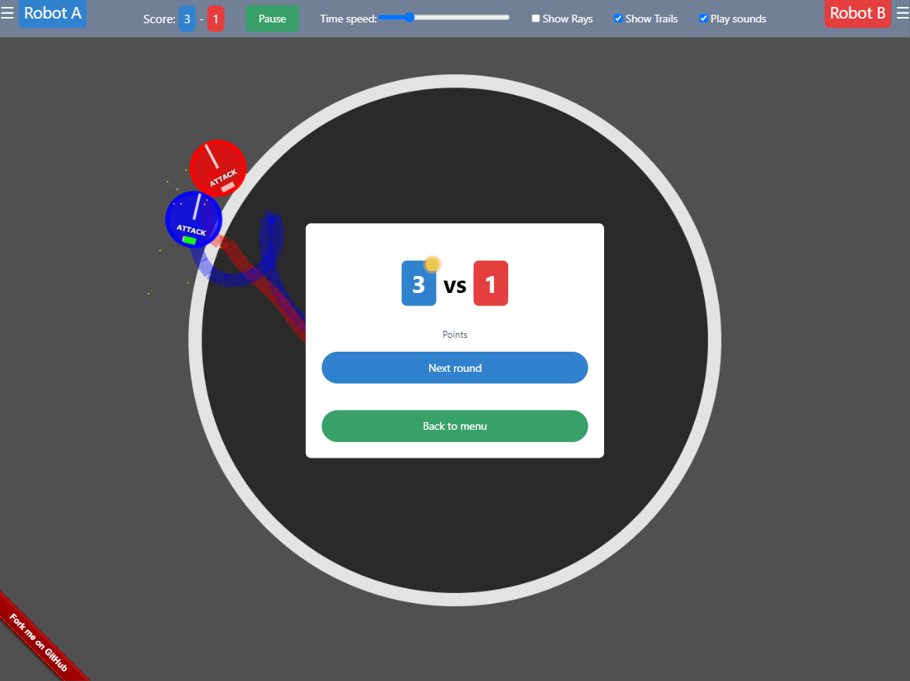

  
   
<a href="https://santiherranz.github.io/SumoFighters/" target="_blank"><b>Play simulator</b></a>
 

   

# ROBOT SUMO BATTLE

Javascript Simulator for testing robot strategies in sumo battle

Work in progress...

## Robot
- Circle body with radius
- Heading
- Bumper

## Robot movement
- Move forward / backward
- Turn left / right
- Side move left / right

## Manual Movement (Only in remote strategy)
- Arrow KEYS or WASD
- W Key = Move forward 
- W Key + SHIFT Key = Move forward double speed 
- S Key = Move backward
- A Key = Turn left
- D Key = Turn right
- A Key + SHIFT Key = Side move to the left
- D Key + SHIFT Key = Side move to the right

## Sensors
- Raycasting: +15/-15 rays or +60/-60 degrees\

- 2 vision layers: Players, Dojo boundaries
- Ground Sensors (Planned)

## Robot strategies
The goal is to push the opponent out of the ring.

- Idle, don't waste your energy
- Wait, idle some time and then change strategy
- Face opponent, spin arround and check for rays reflection to keep opponent in front
- Keep inside dojo, spin arround to detect the ring border then steer moving to the center
- Seek, face opponent and go towards him
- Flee, same as seek but in the opposite direction
- Pursue, face opponent, calculate where will be at current speed and go towards that position
- Evade, same as pursue but in the opposite direction
- Attack, Seek and push him out of the ring
- Defend, face opponent and push when contact
- Remote control

## Energy
- Movements cost energy
- Forward and backward cost is proportional to distance
- Rotation cost is porportional to time

## Effects
- Trails\n when robot moves 
- Particles\n when robots collides

## The Battle
- Battle time shall be based on three matches within three minutes
- The robot who gets two Yuko points during the battle time will be deemed the winner
- If only one Yuko Point has been won by the end of the battle time, the team which has won the Yuko Point will be deemed the winner.
- If neither of the teams wins the match within the battle time, battle time will be extended by three minutes. In the extension time, the team which gets one Yuko Point will be deemed the winner of the battle.

## Robot movements
- move forward
- move backward
- side move left
- side move right
- turn left
- turn right

## Robot movements properties
- move speed
- side move speed
- turn speed

## Strategies 
### Search
Search is continued in the direction that the opponent was last seen

## Dojo (Dohyo)
- Left side is color blue and the right side is color red.
- Starting line (Shikiri-sen)\
Located 10 cm right and left from the center of the Dojo
- White line delimits the external border of the Dojo (Tawara)\
The Tawara shall be considered as within of the Dohyo
- Check limits

## Yuko Point
If any of the following situations arises, the contestant shall get a Yuko Point:

1. Its robot makes the opponent’s robot touch any part outside the Dohyo legally.

2. The opponent's robot touches any part outside the Dohyo for any reason.

3. The opponent's robot is judged as the "Shinitai" pursuant when one or more wheels of the opponent's robot run out of the Dohyo edge, and the judge count until 3 and it cannot return into the Dohyo.

## Ranking list

## Vision
- Scan boundaries
- Raycasting
- Players layer
- Dojo boundaries layer

## All Japan Robot Sumo Tournament Official Regulation
https://www.fsi.co.jp/sumo/robot/en/rule.html

## Online virtual robot competitions.
https://roboton.io/

